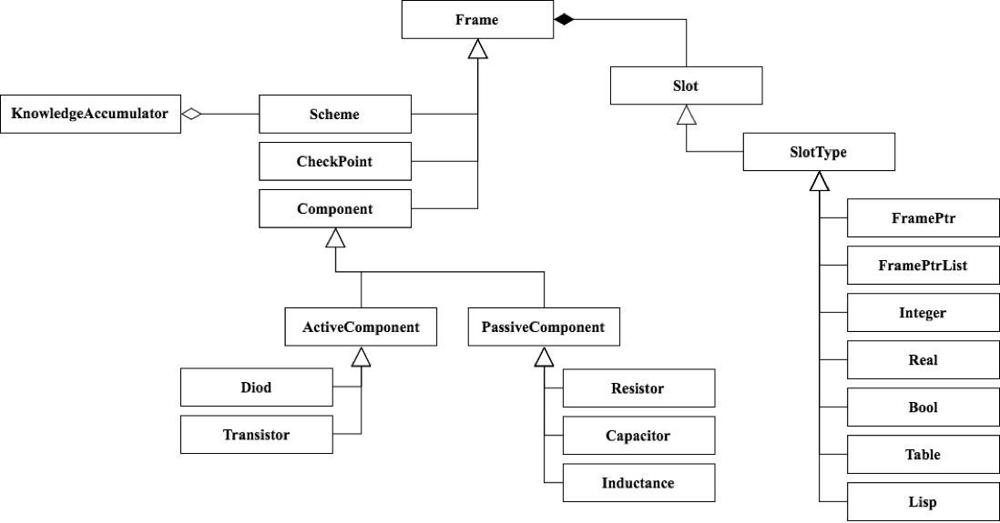

### Фреймовая модель ДИЭС проверки работоспособности  однокаскадного  усилителя  в  статике

Основными  входными  фактами  (данными)  являются  величины  напряжений  в контрольных  точках.

Реализация самой системы и **модуля  накопления  знаний** для неё.

Подробнее: гугл "фреймовая модель представления знаний".

#### Упрощенная диаграмма классов получившейся системы:

